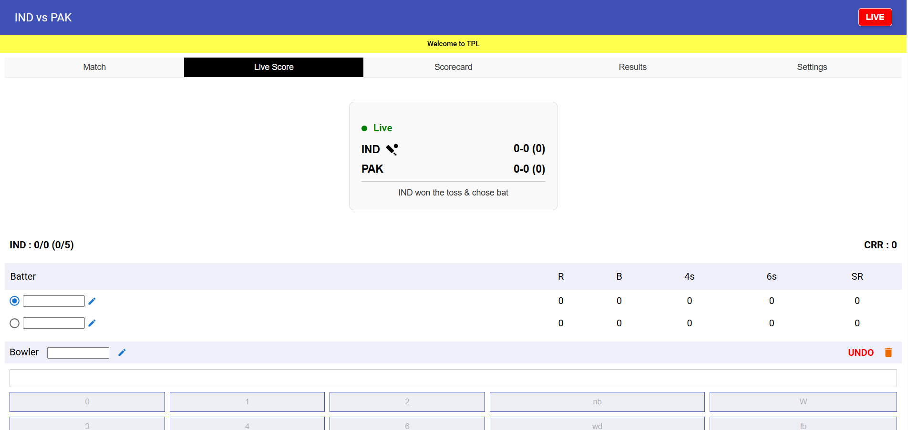

# 🏏 CrickApp – Real-Time Cricket Scoring App 🏏

## 📚 Project Domain
**Domain**: Sports Management & Live Scoring  
**Tech Stack**: MERN (MongoDB, Express.js, React.js, Node.js)

## 💡 Project Idea

CrickApp is a dynamic and interactive cricket scoring application built for real-time match tracking. It allows authenticated admins to create matches, update live scores, and manage player statistics, while users can view live updates, detailed scorecards, and historical match data. The platform supports multiple matches simultaneously, ensuring seamless tracking across various tournaments and formats. With a user-friendly interface and instant data refresh, CrickApp delivers a responsive and engaging experience for both cricket fans and match administrators.

## ✨ Features

### 👨‍💼 Admin Side
- Secure login and admin dashboard
- Create new matches with team and player inputs
- Toss and inning management
- Ball-by-ball score entry with keyboard and UI support
- Save match data and manage intervals

### 👤 User Side
- Live score viewing
- Match summaries and stats
- Responsive and clean interface

### 🧾 Others
- Help center with screenshots and shortcuts
- Interval timer and score preview
- Save match state for future review

## 📁 Folder Overview

```
CrickApp/
├── backend/         # Node.js + Express backend
├── frontend/        # React.js frontend
├── images/          # Screenshots and UI assets
└── README.md        # Project documentation
```

## 🛠️ Getting Started

Follow the steps below to run the project locally:

### 🧬 Clone the Repository
```bash
git clone https://github.com/your-username/CrickApp.git
cd CrickApp
```

### ⚙️ Run Backend
```bash
cd backend
npm install
set NODE_OPTIONS=--openssl-legacy-provider
npm start
```

### 💻 Run Frontend
```bash
cd ../frontend
npm install
set NODE_OPTIONS=--openssl-legacy-provider
npm start
```

> ⚠️ On Unix-based systems (Linux/macOS), use:
```bash
export NODE_OPTIONS=--openssl-legacy-provider
```

## 🔁 Project Workflow

- **Admin Login**: Secure entry for authorized personnel  
- **Match Creation**: Add match details, teams, and players  
- **Toss Screen**: Choose toss winner and decision  
- **Form Setup**: Input players for both teams  
- **Match Start**: Enter scores ball-by-ball using keyboard or UI  
- **Interval**: Break between innings  
- **Second Innings**: Score entry continues  
- **Save Match**: Finalize match and store data  
- **User View**: View scores live with historical data  
- **Help Center**: Instructions and screenshots  

## 🖼️ Screenshot Preview

HOME


TOSS


HELP 


ADMIN MODE


USER MODE


NEW-MATCH 


ADMIN-VIEW




USER-VIEW


INNING-1


INTERVAL (USER-MODE)


INTERVAL (ADMIN-MODE)


INNING-2


SCORE-CARD


## 🔮 Future Enhancements

- Player statistics graphs  
- Export match reports to PDF  
- Authentication with OAuth or Firebase  
- Progressive Web App (PWA) version  

## 👨‍💻 Author

**Ashutosh Birje**  
📧 your.email@example.com  
🔗 [LinkedIn](https://linkedin.com/in/your-profile)  
🌐 [Portfolio](https://your-portfolio.com)
